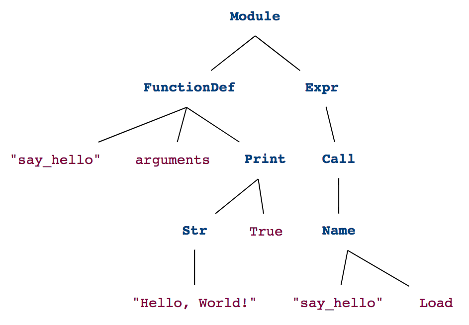
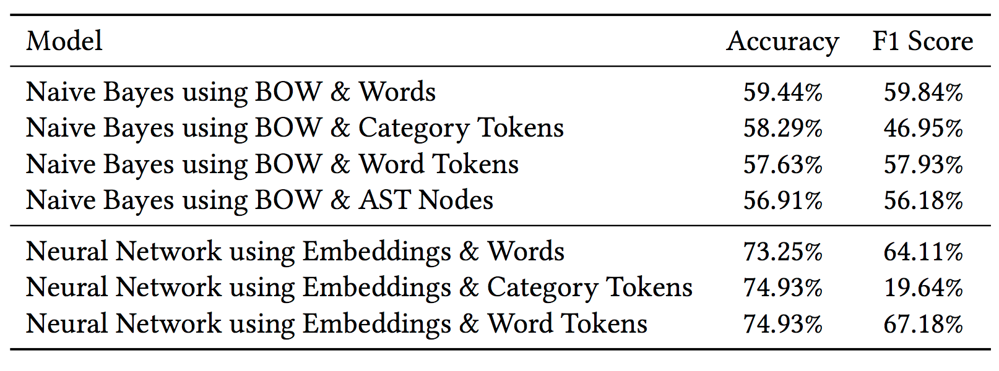
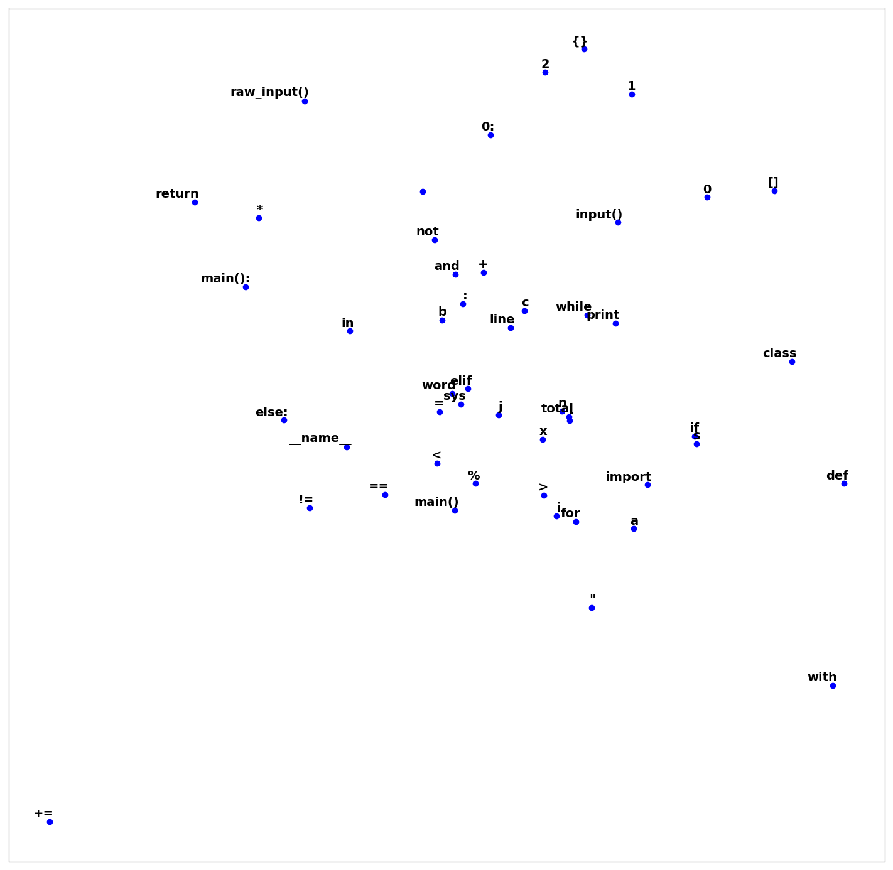
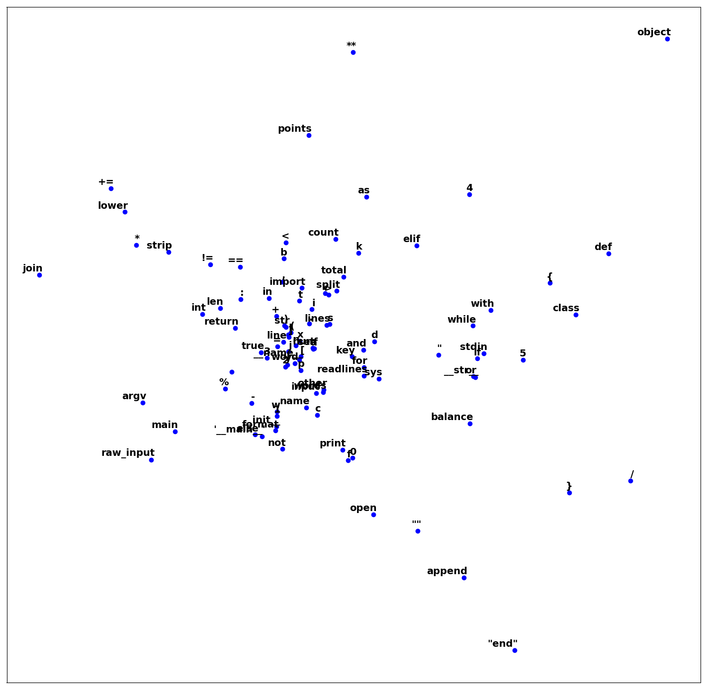
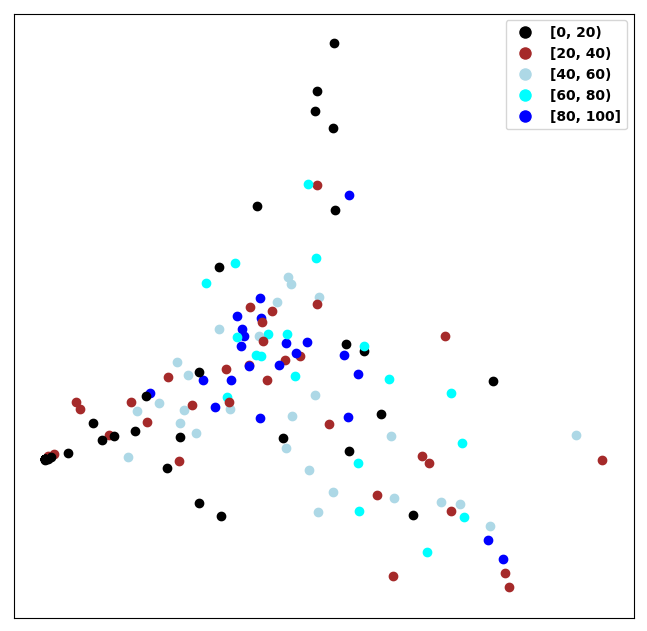
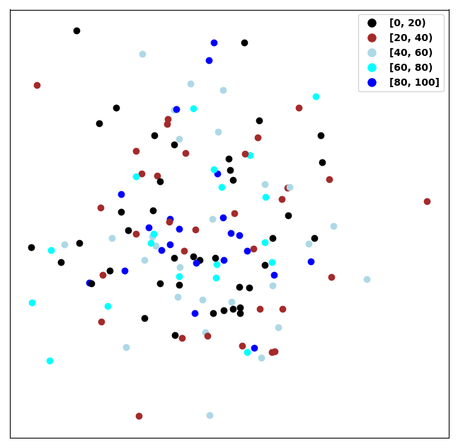
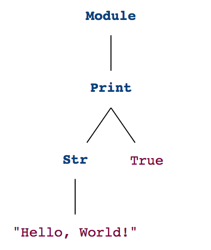
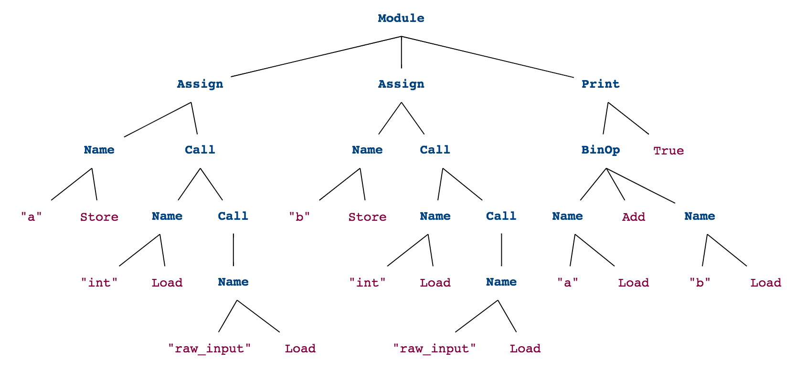

# user2code2vec: Embeddings for Profiling Students Based on Distributional Representations of Source Code 

Full research paper presented at Learning Analytics & Knowledge 2019 Conference in AZ, USA ([LAK 2019](https://lak19.solaresearch.org/))

Please consider [citing](data/citations/azcona2019user2code2vec.md) this paper if you use any of the work.

# Abstract

In this work, we propose a new methodology to profile individual students of Computer Science based on their programming design using embeddings. We investigate different approaches to analyze user source code submissions in the Python language. We compare the performances of different source code vectorization techniques to predict the correctness of a code submission. In addition, we propose a new mechanism to represent students based on their code submissions for a given set of laboratory tasks on a particular course. This way, we can make deeper recommendations for  programming solutions and pathways to support student learning and progression in computer programming modules effectively at a Higher Education Institution. Recent work using Deep Learning tends to work better when more and more data is provided. However, in Learning Analytics, the number of students in a course is an unavoidable limit. Thus we cannot simply generate more data as is done in other domains such as FinTech or Social Network Analysis. Our findings indicate there is a need to learn and develop better mechanisms to extract and learn effective data features from  students so as to analyze the students' progression and performance effectively.

## Representations: Code Vectorization

* [Code Vectorization][vectors]: Representations of programming submissions by tokenizing the code:
    1. Code as Word Vectors: words from the code solutions by spliting it only using the space, tabular (\t) and new line (\n) characters
    2. Code as Token Vectors: [Python’s Tokenizer library](https://docs.python.org/3/library/tokenize.html) for source code analysis which provides a lexical scanner for Python code
    3. Code as Abstract Syntax Tree Vectors: tree representation of the abstract syntactic structure of source code to preserve the structure of the source code in a submission

#### Example that calls a function:

```python
#!/usr/bin/env python
def say_hello():
    print("Hello, World!")
say_hello()
```

1. Code as Word Vectors
```python
['def', 'say_hello():',  'print("Hello,', 'World!")', 'say_hello()']
```

2. Code as Token Vectors: Categories or IDs
```python
Characters      Category    Token
1,0-1,3:	NAME        'def'
1,4-1,13:	NAME        'say_hello'
1,13-1,14:	OP          '('
1,14-1,15:	OP          ')'
1,15-1,16:	OP          ':'
1,16-1,17:	NEWLINE     '\n'
2,0-2,4:	INDENT      '    '
2,4-2,9:	NAME        'print'
2,9-2,10:	OP          '('
2,10-2,25:	STRING      '"Hello, World!"'
2,25-2,26:	OP          ')'
2,26-2,27:	NEWLINE     '\n'
3,0-3,1:	NL          '\n'
4,0-4,0:	DEDENT      ''
4,0-4,9:	NAME        'say_hello'
4,9-4,10:	OP          '('
4,10-4,11:	OP          ')'
4,11-4,12:	NEWLINE     '\n'
5,0-5,0:	ENDMARKER   ''
```

3. Code as Abstract Syntax Tree Vectors
```python
Parent Node     Child Node
'Module'        'FunctionDef'
'Module'        'Expr'
'FunctionDef'   'say_hello'
'FunctionDef'   'arguments'
'FunctionDef'   'Print'
'Expr'          'Call'
'Print'         'Str'
'Print'         'bool'
'Call'          'Name'
'Str'           'Hello\tWorld!'
'Name'          'say_hello'
'Name'          'Load'
```



## code2vec

Transform student code submissions into meaningful vectors using bag-of-words or embeddings. For each technique, we leverage our code vectorization approaches: Words, Python Token Categories, Python Token Words and AST Nodes.
1. Code bag-of-words: orderless source code representation as a bag of its words. Further details: [BOW (bag-of-words) Part I][bow_first], [BOW Part II][bow_second]
2. Code Embeddings: code submissions are mapped into vectors of real numbers in a continuous vector space. Further details: [Embeddings Part I][emb_f], [Embeddings Part II][emb_s]

#### Performance of the Models Using BOW and Embeddings



#### Embeddings for the Top Words \& Token Words Projected from 100D to 2D Using PCA

Embeddings for the Top 20 Most Common Words
 

Embeddings for the Top 20 Most Common Token Words


## user2code2vec

For each course and academic year, a User Representation Matrix is constructed for each student using the code vectors of the submissions to the proposed labsheets by the lecturer. Having a vector representation of code submissions allows researchers to generate a higher-level representation for each student. This User Representation Matrix is built by vectorizing the latest submission for each task using either: 
1. Word Tokenizer
2. Token Word Python Tokenizer

* [user2code2vec][user2code2vec]: vectorization of the User Representation Matrix of shape (number_tasks, MAX_LENGTH). The User Representation Matrix for each student is flattened out as a long vector. PCA is then leveraged as the dimensionality reduction technique to visualize the 100-dimension vectors or user embeddings into 2 dimensions. In short, a student is represented as a vector of her submissions.

User Raw Representations Using Word Tokens
 

User Learned Embeddings Using Word Tokens


Each dot in the graphs is a student represented by the vector of her submissions. For the course analysed, Programming I, these student vectors have 13,800 dimensions: 276 tasks and sequence padding limit is 50. The colors show the performance average on the course and it is very hard to cluster students due to the [Curse of dimensionality](https://en.wikipedia.org/wiki/Curse_of_dimensionality). 

## Conclusion

In a high-dimensional feature space with each feature having a range of possible values, typically an enormous amount of training data is required to ensure that there are several samples with each combination of values. A typical rule of thumb is that there should be at least 5 training examples for each dimension in the representation. Around a hundred of students is not sufficient. Thus instead of representing each student using the concatenation of all their submission made in a course, it would be better to identify important features from each submission and concatenate key features across the code submission. In short, keep the number of features low to effectively learn from constrained data. These user2code2vec representations can then be used to identify student neighbours for programming recommendations. 

## Utils

* [Viz an AST][viz]: An abstract syntax tree (AST) is a tree representation of the abstract syntactic structure of source code written in a programming language. In Python, we leverage the ast module to process trees of the Python abstract syntax grammar. Visualizations are made using a great [notebook](https://github.com/hchasestevens/show_ast) developed by H. Chase Stevens.

* [BOW (bag-of-words)][emb_example]: The bag-of-words model is a simplifying representation used in natural language processing and information retrieval (IR) where a text (such as a sentence or a document) is represented as the bag (multiset) of its words, disregarding grammar and even word order but keeping multiplicity. In order to grab these words from Python source code we can leverage the tokenize module, the tokenizer for Python source.  It provides a lexical scanner for Python source code.

* [Word Embeddings][emb_example]: Word embeddings are feature learning techniques in NLP where words or phrases from the vocabulary are mapped to vectors of real numbers. Conceptually it involves a mathematical embedding from a space with one dimension per word to a continuous vector space with a much lower dimension. A common method to develop this mapping is fitting a Neural Network. We use PCA to reduce the dimensionality of the embeddings and plot them in 2D.

[vectors]: notebooks/Program%20Vectors.ipynb
[bow_first]: notebooks/code2vec%20BOW.ipynb
[bow_second]: notebooks/code2vec%20BOW%20(Train%20%26%20Score).ipynb
[emb_f]: notebooks/code2vec%20Embeddings.ipynb
[emb_s]: notebooks/code2vec%20Embeddings%20II.ipynb
[user2code2vec]: notebooks/user2code2vec.ipynb
[viz]: notebooks/Visualize%20an%20AST.ipynb
[emb_example]: notebooks/Word%20Embeddings%20Example.ipynb
[bow_example]: notebooks/BOW%20Example.ipynb

## Other examples



